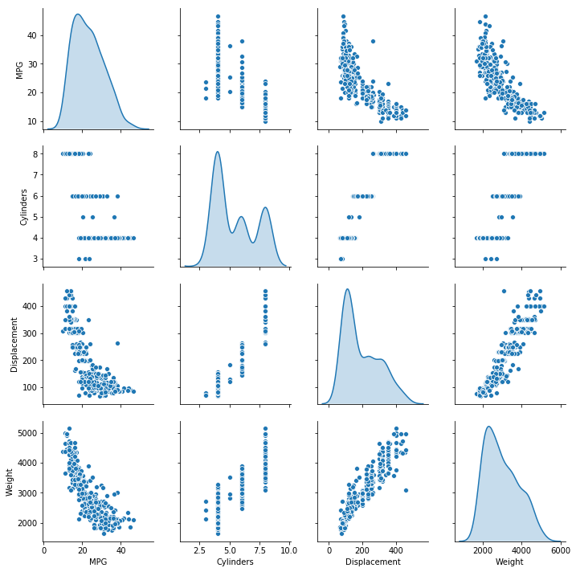
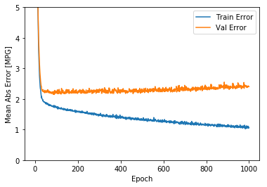
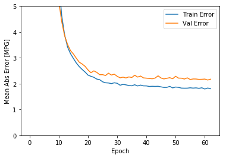
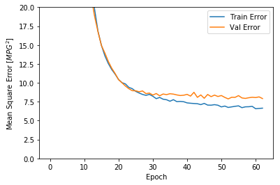
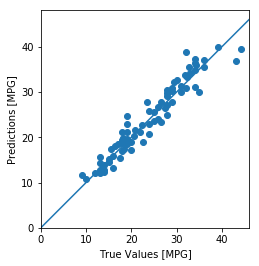
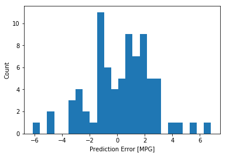

回归问题的目的是预测一个连续值，比如价格或者概率。

本篇使用Auto MPG数据集预测1970s末期和1980s年代初汽车燃料的效能。 这个任务会提供当时的汽车特征，包括：汽缸，排水量，马力，重量等。


```python
from __future__ import absolute_import, division, print_function

import pathlib

import matplotlib.pyplot as plt
import pandas as pd
import seaborn as sns

import tensorflow as tf
from tensorflow import keras
from tensorflow.keras import layers

print(tf.__version__)
```

    1.14.1-dev20190306
    

# Auto MPG数据集
获取数据[UCI Machine Learning Repository](https://archive.ics.uci.edu/ml/datasets/auto+mpg)
## 下载数据


```python
dataset_path = keras.utils.get_file("auto-mpg.data", "https://archive.ics.uci.edu/ml/machine-learning-databases/auto-mpg/auto-mpg.data")
dataset_path
```

    Downloading data from https://archive.ics.uci.edu/ml/machine-learning-databases/auto-mpg/auto-mpg.data
    32768/30286 [================================] - 0s 6us/step
    


    'C:\\Users\\yongrl\\.keras\\datasets\\auto-mpg.data'


## 导入数据


```python
column_names = ['MPG','Cylinders','Displacement','Horsepower','Weight',
                'Acceleration', 'Model Year', 'Origin'] 
raw_dataset = pd.read_csv(dataset_path, names=column_names,
                      na_values = "?", comment='\t',
                      sep=" ", skipinitialspace=True)

dataset = raw_dataset.copy()
dataset.tail()
```


<div>
<style scoped>
    .dataframe tbody tr th:only-of-type {
        vertical-align: middle;
    }

    .dataframe tbody tr th {
        vertical-align: top;
    }

    .dataframe thead th {
        text-align: right;
    }
</style>
<table border="1" class="dataframe">
  <thead>
    <tr style="text-align: right;">
      <th></th>
      <th>MPG</th>
      <th>Cylinders</th>
      <th>Displacement</th>
      <th>Horsepower</th>
      <th>Weight</th>
      <th>Acceleration</th>
      <th>Model Year</th>
      <th>Origin</th>
    </tr>
  </thead>
  <tbody>
    <tr>
      <th>393</th>
      <td>27.0</td>
      <td>4</td>
      <td>140.0</td>
      <td>86.0</td>
      <td>2790.0</td>
      <td>15.6</td>
      <td>82</td>
      <td>1</td>
    </tr>
    <tr>
      <th>394</th>
      <td>44.0</td>
      <td>4</td>
      <td>97.0</td>
      <td>52.0</td>
      <td>2130.0</td>
      <td>24.6</td>
      <td>82</td>
      <td>2</td>
    </tr>
    <tr>
      <th>395</th>
      <td>32.0</td>
      <td>4</td>
      <td>135.0</td>
      <td>84.0</td>
      <td>2295.0</td>
      <td>11.6</td>
      <td>82</td>
      <td>1</td>
    </tr>
    <tr>
      <th>396</th>
      <td>28.0</td>
      <td>4</td>
      <td>120.0</td>
      <td>79.0</td>
      <td>2625.0</td>
      <td>18.6</td>
      <td>82</td>
      <td>1</td>
    </tr>
    <tr>
      <th>397</th>
      <td>31.0</td>
      <td>4</td>
      <td>119.0</td>
      <td>82.0</td>
      <td>2720.0</td>
      <td>19.4</td>
      <td>82</td>
      <td>1</td>
    </tr>
  </tbody>
</table>
</div>


## 清洗数据
数据包含空值


```python
dataset.isna().sum()
```


    MPG             0
    Cylinders       0
    Displacement    0
    Horsepower      6
    Weight          0
    Acceleration    0
    Model Year      0
    Origin          0
    dtype: int64


 删除空值 


```python
dataset = dataset.dropna()
```

"Origin"特征为类别型，将其转换为one-hot形式


```python
origin = dataset.pop('Origin')
```


```python
dataset['USA'] = (origin == 1)*1.0
dataset['Europe'] = (origin == 2)*1.0
dataset['Japan'] = (origin == 3)*1.0
dataset.tail()
```


<div>
<style scoped>
    .dataframe tbody tr th:only-of-type {
        vertical-align: middle;
    }

    .dataframe tbody tr th {
        vertical-align: top;
    }

    .dataframe thead th {
        text-align: right;
    }
</style>
<table border="1" class="dataframe">
  <thead>
    <tr style="text-align: right;">
      <th></th>
      <th>MPG</th>
      <th>Cylinders</th>
      <th>Displacement</th>
      <th>Horsepower</th>
      <th>Weight</th>
      <th>Acceleration</th>
      <th>Model Year</th>
      <th>USA</th>
      <th>Europe</th>
      <th>Japan</th>
    </tr>
  </thead>
  <tbody>
    <tr>
      <th>393</th>
      <td>27.0</td>
      <td>4</td>
      <td>140.0</td>
      <td>86.0</td>
      <td>2790.0</td>
      <td>15.6</td>
      <td>82</td>
      <td>1.0</td>
      <td>0.0</td>
      <td>0.0</td>
    </tr>
    <tr>
      <th>394</th>
      <td>44.0</td>
      <td>4</td>
      <td>97.0</td>
      <td>52.0</td>
      <td>2130.0</td>
      <td>24.6</td>
      <td>82</td>
      <td>0.0</td>
      <td>1.0</td>
      <td>0.0</td>
    </tr>
    <tr>
      <th>395</th>
      <td>32.0</td>
      <td>4</td>
      <td>135.0</td>
      <td>84.0</td>
      <td>2295.0</td>
      <td>11.6</td>
      <td>82</td>
      <td>1.0</td>
      <td>0.0</td>
      <td>0.0</td>
    </tr>
    <tr>
      <th>396</th>
      <td>28.0</td>
      <td>4</td>
      <td>120.0</td>
      <td>79.0</td>
      <td>2625.0</td>
      <td>18.6</td>
      <td>82</td>
      <td>1.0</td>
      <td>0.0</td>
      <td>0.0</td>
    </tr>
    <tr>
      <th>397</th>
      <td>31.0</td>
      <td>4</td>
      <td>119.0</td>
      <td>82.0</td>
      <td>2720.0</td>
      <td>19.4</td>
      <td>82</td>
      <td>1.0</td>
      <td>0.0</td>
      <td>0.0</td>
    </tr>
  </tbody>
</table>
</div>


## 数据分割


```python
train_dataset = dataset.sample(frac=0.8,random_state=0)
test_dataset = dataset.drop(train_dataset.index)
```

# 数据探索
查看特征对的联合分布


```python
sns.pairplot(train_dataset[["MPG", "Cylinders", "Displacement", "Weight"]], diag_kind="kde")
```

    d:\python\lib\site-packages\scipy\stats\stats.py:1706: FutureWarning: Using a non-tuple sequence for multidimensional indexing is deprecated; use `arr[tuple(seq)]` instead of `arr[seq]`. In the future this will be interpreted as an array index, `arr[np.array(seq)]`, which will result either in an error or a different result.
      return np.add.reduce(sorted[indexer] * weights, axis=axis) / sumval
    


    <seaborn.axisgrid.PairGrid at 0x181d034e6a0>





数据的全局统计


```python
train_stats = train_dataset.describe()
train_stats.pop("MPG")
train_stats = train_stats.transpose()
train_stats
```


<div>
<style scoped>
    .dataframe tbody tr th:only-of-type {
        vertical-align: middle;
    }

    .dataframe tbody tr th {
        vertical-align: top;
    }

    .dataframe thead th {
        text-align: right;
    }
</style>
<table border="1" class="dataframe">
  <thead>
    <tr style="text-align: right;">
      <th></th>
      <th>count</th>
      <th>mean</th>
      <th>std</th>
      <th>min</th>
      <th>25%</th>
      <th>50%</th>
      <th>75%</th>
      <th>max</th>
    </tr>
  </thead>
  <tbody>
    <tr>
      <th>Cylinders</th>
      <td>314.0</td>
      <td>5.477707</td>
      <td>1.699788</td>
      <td>3.0</td>
      <td>4.00</td>
      <td>4.0</td>
      <td>8.00</td>
      <td>8.0</td>
    </tr>
    <tr>
      <th>Displacement</th>
      <td>314.0</td>
      <td>195.318471</td>
      <td>104.331589</td>
      <td>68.0</td>
      <td>105.50</td>
      <td>151.0</td>
      <td>265.75</td>
      <td>455.0</td>
    </tr>
    <tr>
      <th>Horsepower</th>
      <td>314.0</td>
      <td>104.869427</td>
      <td>38.096214</td>
      <td>46.0</td>
      <td>76.25</td>
      <td>94.5</td>
      <td>128.00</td>
      <td>225.0</td>
    </tr>
    <tr>
      <th>Weight</th>
      <td>314.0</td>
      <td>2990.251592</td>
      <td>843.898596</td>
      <td>1649.0</td>
      <td>2256.50</td>
      <td>2822.5</td>
      <td>3608.00</td>
      <td>5140.0</td>
    </tr>
    <tr>
      <th>Acceleration</th>
      <td>314.0</td>
      <td>15.559236</td>
      <td>2.789230</td>
      <td>8.0</td>
      <td>13.80</td>
      <td>15.5</td>
      <td>17.20</td>
      <td>24.8</td>
    </tr>
    <tr>
      <th>Model Year</th>
      <td>314.0</td>
      <td>75.898089</td>
      <td>3.675642</td>
      <td>70.0</td>
      <td>73.00</td>
      <td>76.0</td>
      <td>79.00</td>
      <td>82.0</td>
    </tr>
    <tr>
      <th>USA</th>
      <td>314.0</td>
      <td>0.624204</td>
      <td>0.485101</td>
      <td>0.0</td>
      <td>0.00</td>
      <td>1.0</td>
      <td>1.00</td>
      <td>1.0</td>
    </tr>
    <tr>
      <th>Europe</th>
      <td>314.0</td>
      <td>0.178344</td>
      <td>0.383413</td>
      <td>0.0</td>
      <td>0.00</td>
      <td>0.0</td>
      <td>0.00</td>
      <td>1.0</td>
    </tr>
    <tr>
      <th>Japan</th>
      <td>314.0</td>
      <td>0.197452</td>
      <td>0.398712</td>
      <td>0.0</td>
      <td>0.00</td>
      <td>0.0</td>
      <td>0.00</td>
      <td>1.0</td>
    </tr>
  </tbody>
</table>
</div>


```python
train_labels = train_dataset.pop('MPG')
test_labels = test_dataset.pop('MPG')
```

## 正则化数据


```python
def norm(x):
  return (x - train_stats['mean']) / train_stats['std']
normed_train_data = norm(train_dataset)
normed_test_data = norm(test_dataset)
```

# 模型
## 构建模型
使用序列模型Sequential构建两个全连接隐藏层，返回一个连续数值


```python
def build_model():
  model = keras.Sequential([
    layers.Dense(64, activation=tf.nn.relu, input_shape=[len(train_dataset.keys())]),
    layers.Dense(64, activation=tf.nn.relu),
    layers.Dense(1)
  ])

  optimizer = tf.keras.optimizers.RMSprop(0.001)

  model.compile(loss='mean_squared_error',
                optimizer=optimizer,
                metrics=['mean_absolute_error', 'mean_squared_error'])
  return model
```


```python
model = build_model()
```

    WARNING: Logging before flag parsing goes to stderr.
    W0315 19:06:10.922565 21072 deprecation.py:506] From d:\python\lib\site-packages\tensorflow\python\ops\init_ops.py:1257: calling VarianceScaling.__init__ (from tensorflow.python.ops.init_ops) with dtype is deprecated and will be removed in a future version.
    Instructions for updating:
    Call initializer instance with the dtype argument instead of passing it to the constructor
    

## 模型探查


```python
model.summary()
```

    Model: "sequential"
    _________________________________________________________________
    Layer (type)                 Output Shape              Param #   
    =================================================================
    dense (Dense)                (None, 64)                640       
    _________________________________________________________________
    dense_1 (Dense)              (None, 64)                4160      
    _________________________________________________________________
    dense_2 (Dense)              (None, 1)                 65        
    =================================================================
    Total params: 4,865
    Trainable params: 4,865
    Non-trainable params: 0
    _________________________________________________________________
    

用一个包含10个样本的batch,调用模型的预测函数，查看模型是否有用


```python
example_batch = normed_train_data[:10]
example_result = model.predict(example_batch)
example_result
```


    array([[ 0.08544084],
           [ 0.09042378],
           [-0.26605514],
           [-0.08686881],
           [ 0.0088494 ],
           [-0.1798531 ],
           [ 0.04614539],
           [-0.71821   ],
           [-0.06275775],
           [ 0.04445852]], dtype=float32)


模型有效，输出了预期形式的值

## 模型训练
训练1000个epoch, 将训练和验证集结果记录在history 中


```python
# Display training progress by printing a single dot for each completed epoch
class PrintDot(keras.callbacks.Callback):
  def on_epoch_end(self, epoch, logs):
    if epoch % 100 == 0: print('')
    print('.', end='')

EPOCHS = 1000

history = model.fit(
  normed_train_data, train_labels,
  epochs=EPOCHS, validation_split = 0.2, verbose=0,
  callbacks=[PrintDot()])
```

    
    ....................................................................................................
    ....................................................................................................
    ....................................................................................................
    ....................................................................................................
    ....................................................................................................
    ....................................................................................................
    ....................................................................................................
    ....................................................................................................
    ....................................................................................................
    ....................................................................................................

输出模型的中间结果


```python
hist = pd.DataFrame(history.history)
hist['epoch'] = history.epoch
hist.tail()
```


<div>
<style scoped>
    .dataframe tbody tr th:only-of-type {
        vertical-align: middle;
    }

    .dataframe tbody tr th {
        vertical-align: top;
    }

    .dataframe thead th {
        text-align: right;
    }
</style>
<table border="1" class="dataframe">
  <thead>
    <tr style="text-align: right;">
      <th></th>
      <th>loss</th>
      <th>mean_absolute_error</th>
      <th>mean_squared_error</th>
      <th>val_loss</th>
      <th>val_mean_absolute_error</th>
      <th>val_mean_squared_error</th>
      <th>epoch</th>
    </tr>
  </thead>
  <tbody>
    <tr>
      <th>995</th>
      <td>3.201072</td>
      <td>1.112118</td>
      <td>3.201072</td>
      <td>9.970906</td>
      <td>2.410903</td>
      <td>9.970905</td>
      <td>995</td>
    </tr>
    <tr>
      <th>996</th>
      <td>2.871416</td>
      <td>1.041912</td>
      <td>2.871416</td>
      <td>10.079881</td>
      <td>2.429953</td>
      <td>10.079881</td>
      <td>996</td>
    </tr>
    <tr>
      <th>997</th>
      <td>2.915039</td>
      <td>1.052468</td>
      <td>2.915039</td>
      <td>9.703000</td>
      <td>2.401823</td>
      <td>9.702999</td>
      <td>997</td>
    </tr>
    <tr>
      <th>998</th>
      <td>3.173562</td>
      <td>1.085473</td>
      <td>3.173562</td>
      <td>9.984947</td>
      <td>2.418469</td>
      <td>9.984946</td>
      <td>998</td>
    </tr>
    <tr>
      <th>999</th>
      <td>3.014314</td>
      <td>1.056457</td>
      <td>3.014314</td>
      <td>10.011401</td>
      <td>2.407715</td>
      <td>10.011401</td>
      <td>999</td>
    </tr>
  </tbody>
</table>
</div>


## 可视化结果


```python
def plot_history(history):
  hist = pd.DataFrame(history.history)
  hist['epoch'] = history.epoch
  
  plt.figure()
  plt.xlabel('Epoch')
  plt.ylabel('Mean Abs Error [MPG]')
  plt.plot(hist['epoch'], hist['mean_absolute_error'],
           label='Train Error')
  plt.plot(hist['epoch'], hist['val_mean_absolute_error'],
           label = 'Val Error')
  plt.ylim([0,5])
  plt.legend()
  
  plt.figure()
  plt.xlabel('Epoch')
  plt.ylabel('Mean Square Error [$MPG^2$]')
  plt.plot(hist['epoch'], hist['mean_squared_error'],
           label='Train Error')
  plt.plot(hist['epoch'], hist['val_mean_squared_error'],
           label = 'Val Error')
  plt.ylim([0,20])
  plt.legend()
  plt.show()


plot_history(history)
```





模型在验证集上的效果在100epoch之后下降，下面使用EarlyStopping callback，模型的效果在几轮训练之后没有提升，将会自动停止训练


```python
model = build_model()

# The patience parameter is the amount of epochs to check for improvement
early_stop = keras.callbacks.EarlyStopping(monitor='val_loss', patience=10)

history = model.fit(normed_train_data, train_labels, epochs=EPOCHS,
                    validation_split = 0.2, verbose=0, callbacks=[early_stop, PrintDot()])

plot_history(history)
```

    
    ...............................................................








## 模型验证


```python
loss, mae, mse = model.evaluate(normed_test_data, test_labels, verbose=0)

print("Testing set Mean Abs Error: {:5.2f} MPG".format(mae))
```

    Testing set Mean Abs Error:  1.81 MPG
    

## 模型预测


```python
test_predictions = model.predict(normed_test_data).flatten()

plt.scatter(test_labels, test_predictions)
plt.xlabel('True Values [MPG]')
plt.ylabel('Predictions [MPG]')
plt.axis('equal')
plt.axis('square')
plt.xlim([0,plt.xlim()[1]])
plt.ylim([0,plt.ylim()[1]])
_ = plt.plot([-100, 100], [-100, 100])
```





## 误差分布


```python
error = test_predictions - test_labels
plt.hist(error, bins = 25)
plt.xlabel("Prediction Error [MPG]")
_ = plt.ylabel("Count")
```





误差并不服从明显的高斯分布，可能是样本量太少。

# 总结
本文介绍了解决回归问题的一些技术：
- MSE是回归问题常用的损失函数
- 回归问题的模型评价准则也和分类问题不同个，一般用Mean Absolute Error(MAE)
- 数值型特征应当进行量纲归一
- 如果训练数据不多，可以减少隐藏层数量来避免过拟合
- Early stopping可以防止过拟合
