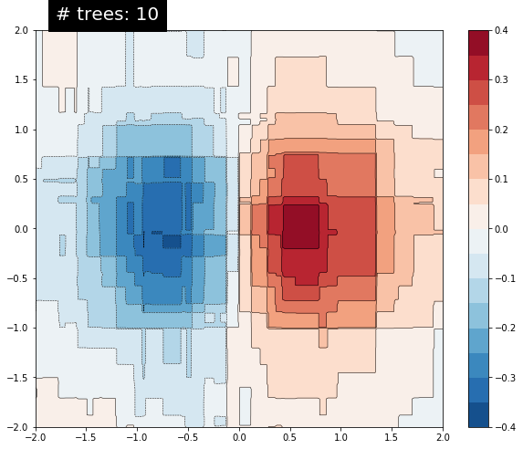

在前一篇《boosted trees》中完整的训练了一个Boosted分类树，这篇文章主要是在上篇的基础上讲解以下两个内容：
- 怎么从局部和全局的角度理解Boosted Tree 模型的可解释性
- 从直觉上了解Boosted Tree 是怎么进行数据训练的

# 模型的可解释性
局部可解释性（Local interpretability）是指理解模型对一个样本的预测结果的可解释性，全局可解释性（ Global  interpretability）指模型的决策方式时可解释的。

对于局部可解释性，学习创建和可视化每个样本的贡献(contributions),这和特征的重要性不同，样本的重要性值称作定向特征贡献（directional feature contributions，DFCs）

全局的可解释性可以获取和可视化gain-based feature importances、permutation feature importances 和aggregated DFCs。

PS:教程在最开始的时候有一句 pip install -q tf-nightly # Requires tf 1.13，因为对tf-nightly不是很了解，我自己的机子上安装了tensorflow-1.13.1,所以没有管它，但是最后没有跑出想要的结果：对类别型特征进行了one-hot之后，该特征应当仍然被当做一个特征去分析其重要性的，但是tensorflow-1.13.1是将one-hot之后的特征看做了多个独立特征去分析了，这偏离了我原来使用tf去训练BD Tree的宗旨，最终检查多遍代码之后，我将可能的原因归结为tf-nightly,但是网上tf-nightly的资料并不是很多，我现在的理解是tf-nightly是tensorflow的开发版本，里面有一些tensorflow没有的功能，但是还不是很稳定。在安装的时候，也走了一些弯路，需要把tensorflow 先卸载干净之后在安装tf-nightly。正好昨天（3.6），tf-nightly发布了新的版本1.14.1-dev20190306，我也算尝鲜了，哈哈。

# 构建模型
## 加载数据


```python
from __future__ import absolute_import, division, print_function

import numpy as np
import pandas as pd
import tensorflow as tf

tf.logging.set_verbosity(tf.logging.ERROR)
tf.set_random_seed(123)

# Load dataset.
dftrain = pd.read_csv('https://storage.googleapis.com/tfbt/titanic_train.csv')
dfeval = pd.read_csv('https://storage.googleapis.com/tfbt/titanic_eval.csv')
y_train = dftrain.pop('survived')
y_eval = dfeval.pop('survived')
```

## 创建特征


```python
fc = tf.feature_column
CATEGORICAL_COLUMNS = ['sex', 'n_siblings_spouses', 'parch', 'class', 'deck', 
                       'embark_town', 'alone']
NUMERIC_COLUMNS = ['age', 'fare']
  
def one_hot_cat_column(feature_name, vocab):
  return fc.indicator_column(
      fc.categorical_column_with_vocabulary_list(feature_name,
                                                 vocab))
feature_columns = []
for feature_name in CATEGORICAL_COLUMNS:
  # Need to one-hot encode categorical features.
  vocabulary = dftrain[feature_name].unique()
  feature_columns.append(one_hot_cat_column(feature_name, vocabulary))
  
for feature_name in NUMERIC_COLUMNS:
  feature_columns.append(fc.numeric_column(feature_name,dtype=tf.float32))
```

## 输入


```python
# Use entire batch since this is such a small dataset.
NUM_EXAMPLES = len(y_train)

def make_input_fn(X, y, n_epochs=None, shuffle=True):
  def input_fn():
    dataset = tf.data.Dataset.from_tensor_slices((X.to_dict(orient='list'), y))
    if shuffle:
      # batchsize = NUM_EXAMPLES 时，batchsize过大会报kernal restarting 错误
      dataset = dataset.shuffle(64)
    # For training, cycle thru dataset as many times as need (n_epochs=None).    
    dataset = (dataset
      .repeat(n_epochs)
      .batch(64)) 
    return dataset
  return input_fn

# Training and evaluation input functions.
train_input_fn = make_input_fn(dftrain, y_train)
eval_input_fn = make_input_fn(dfeval, y_eval, shuffle=False, n_epochs=1)
```


```python
len(dftrain)
```


    627


## 模型训练


```python
params = {
  'n_trees': 100,
  'max_depth': 3,
  'n_batches_per_layer': 1,
  # You must enable center_bias = True to get DFCs. This will force the model to 
  # make an initial prediction before using any features (e.g. use the mean of 
  # the training labels for regression or log odds for classification when
  # using cross entropy loss).
  'center_bias': True
}

est = tf.estimator.BoostedTreesClassifier(feature_columns, **params)
est.train(train_input_fn, max_steps=100)
results = est.evaluate(eval_input_fn)
pd.Series(results).to_frame()
```


<div>
<style scoped>
    .dataframe tbody tr th:only-of-type {
        vertical-align: middle;
    }

    .dataframe tbody tr th {
        vertical-align: top;
    }

    .dataframe thead th {
        text-align: right;
    }
</style>
<table border="1" class="dataframe">
  <thead>
    <tr style="text-align: right;">
      <th></th>
      <th>0</th>
    </tr>
  </thead>
  <tbody>
    <tr>
      <th>accuracy</th>
      <td>0.810606</td>
    </tr>
    <tr>
      <th>accuracy_baseline</th>
      <td>0.625000</td>
    </tr>
    <tr>
      <th>auc</th>
      <td>0.842975</td>
    </tr>
    <tr>
      <th>auc_precision_recall</th>
      <td>0.824142</td>
    </tr>
    <tr>
      <th>average_loss</th>
      <td>0.455730</td>
    </tr>
    <tr>
      <th>label/mean</th>
      <td>0.375000</td>
    </tr>
    <tr>
      <th>loss</th>
      <td>0.432008</td>
    </tr>
    <tr>
      <th>precision</th>
      <td>0.788235</td>
    </tr>
    <tr>
      <th>prediction/mean</th>
      <td>0.387055</td>
    </tr>
    <tr>
      <th>recall</th>
      <td>0.676768</td>
    </tr>
    <tr>
      <th>global_step</th>
      <td>100.000000</td>
    </tr>
  </tbody>
</table>
</div>


# local interpretability


```python
import matplotlib.pyplot as plt
import seaborn as sns
sns_colors = sns.color_palette('colorblind')
```


```python
pred_dicts = list(est.experimental_predict_with_explanations(eval_input_fn))
```


```python
pred_dicts[1]
```


    {'logits': array([-0.49212736], dtype=float32),
     'logistic': array([0.37939256], dtype=float32),
     'probabilities': array([0.62060744, 0.37939253], dtype=float32),
     'class_ids': array([0], dtype=int64),
     'classes': array([b'0'], dtype=object),
     'bias': 0.3437500217477164,
     'dfc': OrderedDict([('sex', -0.1362820723090153),
                  ('fare', 0.08740152782898775),
                  ('deck', 0.07717052414217734),
                  ('class', 0.061006841092034136),
                  ('embark_town', -0.054895610810640705),
                  ('age', -0.018217264776154762),
                  ('parch', 0.012589504296639242),
                  ('n_siblings_spouses', 0.006869073255146851),
                  ('alone', 0.0)])}


```python
# Create DFC Pandas dataframe.
labels = y_eval.values
probs = pd.Series([pred['probabilities'][1] for pred in pred_dicts])
df_dfc = pd.DataFrame([pred['dfc'] for pred in pred_dicts])
df_dfc.describe().T
```


<div>
<style scoped>
    .dataframe tbody tr th:only-of-type {
        vertical-align: middle;
    }

    .dataframe tbody tr th {
        vertical-align: top;
    }

    .dataframe thead th {
        text-align: right;
    }
</style>
<table border="1" class="dataframe">
  <thead>
    <tr style="text-align: right;">
      <th></th>
      <th>count</th>
      <th>mean</th>
      <th>std</th>
      <th>min</th>
      <th>25%</th>
      <th>50%</th>
      <th>75%</th>
      <th>max</th>
    </tr>
  </thead>
  <tbody>
    <tr>
      <th>age</th>
      <td>264.0</td>
      <td>0.009450</td>
      <td>0.081673</td>
      <td>-0.105591</td>
      <td>-0.040991</td>
      <td>-0.008687</td>
      <td>0.029089</td>
      <td>0.331626</td>
    </tr>
    <tr>
      <th>sex</th>
      <td>264.0</td>
      <td>-0.002487</td>
      <td>0.115896</td>
      <td>-0.157026</td>
      <td>-0.091049</td>
      <td>-0.066526</td>
      <td>0.135913</td>
      <td>0.196724</td>
    </tr>
    <tr>
      <th>embark_town</th>
      <td>264.0</td>
      <td>-0.015108</td>
      <td>0.065171</td>
      <td>-0.105188</td>
      <td>-0.055726</td>
      <td>-0.045491</td>
      <td>0.015000</td>
      <td>0.199845</td>
    </tr>
    <tr>
      <th>fare</th>
      <td>264.0</td>
      <td>0.048854</td>
      <td>0.097702</td>
      <td>-0.105521</td>
      <td>-0.031787</td>
      <td>0.026067</td>
      <td>0.099456</td>
      <td>0.300124</td>
    </tr>
    <tr>
      <th>deck</th>
      <td>264.0</td>
      <td>-0.008877</td>
      <td>0.027764</td>
      <td>-0.042782</td>
      <td>-0.022066</td>
      <td>-0.014940</td>
      <td>-0.006706</td>
      <td>0.136220</td>
    </tr>
    <tr>
      <th>class</th>
      <td>264.0</td>
      <td>0.018992</td>
      <td>0.070895</td>
      <td>-0.229208</td>
      <td>-0.028784</td>
      <td>-0.009440</td>
      <td>0.072323</td>
      <td>0.193327</td>
    </tr>
    <tr>
      <th>parch</th>
      <td>264.0</td>
      <td>-0.003682</td>
      <td>0.018285</td>
      <td>-0.062094</td>
      <td>-0.004519</td>
      <td>-0.002029</td>
      <td>0.008646</td>
      <td>0.060175</td>
    </tr>
    <tr>
      <th>n_siblings_spouses</th>
      <td>264.0</td>
      <td>-0.003176</td>
      <td>0.024600</td>
      <td>-0.131421</td>
      <td>-0.010299</td>
      <td>-0.002582</td>
      <td>0.005173</td>
      <td>0.061435</td>
    </tr>
    <tr>
      <th>alone</th>
      <td>264.0</td>
      <td>-0.000661</td>
      <td>0.006292</td>
      <td>-0.027930</td>
      <td>0.000000</td>
      <td>0.000000</td>
      <td>0.000000</td>
      <td>0.070025</td>
    </tr>
  </tbody>
</table>
</div>


```python
# Sum of DFCs + bias == probabality.
bias = pred_dicts[0]['bias']
dfc_prob = df_dfc.sum(axis=1) + bias
np.testing.assert_almost_equal(dfc_prob.values,
                               probs.values)
```

## 可视化DFCs


```python
# Plot results.
ID = 1
example = df_dfc.iloc[ID]  # Choose ith example from evaluation set.
TOP_N = 8  # View top 8 features.
sorted_ix = example.abs().sort_values()[-TOP_N:].index
ax = example[sorted_ix].plot(kind='barh', color=sns_colors[3])
ax.grid(False, axis='y')

ax.set_title('Feature contributions for example {}\n pred: {:1.2f}; label: {}'.format(ID, probs[ID], labels[ID]))
ax.set_xlabel('Contribution to predicted probability');
```


## 优化可视化


```python
# Boilerplate code for plotting :)
def _get_color(value):
    """To make positive DFCs plot green, negative DFCs plot red."""
    green, red = sns.color_palette()[2:4]
    if value >= 0: return green
    return red

def _add_feature_values(feature_values, ax):
    """Display feature's values on left of plot."""
    x_coord = ax.get_xlim()[0]
    OFFSET = 0.15
    for y_coord, (feat_name, feat_val) in enumerate(feature_values.items()):
        t = plt.text(x_coord, y_coord - OFFSET, '{}'.format(feat_val), size=12)
        t.set_bbox(dict(facecolor='white', alpha=0.5))
    from matplotlib.font_manager import FontProperties
    font = FontProperties()
    font.set_weight('bold')
    t = plt.text(x_coord, y_coord + 1 - OFFSET, 'feature\nvalue',
    fontproperties=font, size=12)
    
def plot_example(example):
  TOP_N = 8 # View top 8 features.
  sorted_ix = example.abs().sort_values()[-TOP_N:].index  # Sort by magnitude.
  example = example[sorted_ix]
  colors = example.map(_get_color).tolist()
  ax = example.to_frame().plot(kind='barh',
                          color=[colors],
                          legend=None,
                          alpha=0.75,
                          figsize=(10,6))
  ax.grid(False, axis='y')
  ax.set_yticklabels(ax.get_yticklabels(), size=14)

  # Add feature values.
  _add_feature_values(dfeval.iloc[ID][sorted_ix], ax)
  return ax
```


```python
example = df_dfc.iloc[ID]  # Choose IDth example from evaluation set.
ax = plot_example(example)
ax.set_title('Feature contributions for example {}\n pred: {:1.2f}; label: {}'.format(ID, probs[ID], labels[ID]))
ax.set_xlabel('Contribution to predicted probability', size=14);
```


## 单个DFS VS. ALL


```python
# Boilerplate plotting code.
def dist_violin_plot(df_dfc, ID):
  # Initialize plot.
  fig, ax = plt.subplots(1, 1, figsize=(10, 6))
  
  # Create example dataframe.
  TOP_N = 8  # View top 8 features.
  example = df_dfc.iloc[ID]
  ix = example.abs().sort_values()[-TOP_N:].index
  example = example[ix]
  example_df = example.to_frame(name='dfc')
  
  # Add contributions of entire distribution.
  parts=ax.violinplot([df_dfc[w] for w in ix],
                 vert=False,
                 showextrema=False,
                 widths=0.7,
                 positions=np.arange(len(ix)))
  face_color = sns_colors[0]
  alpha = 0.15
  for pc in parts['bodies']:
      pc.set_facecolor(face_color)
      pc.set_alpha(alpha)
  
  # Add feature values.
  _add_feature_values(dfeval.iloc[ID][sorted_ix], ax)

  # Add local contributions.
  ax.scatter(example,
              np.arange(example.shape[0]),
              color=sns.color_palette()[2],
              s=100,
              marker="s",
              label='contributions for example')
  
  # Legend
  # Proxy plot, to show violinplot dist on legend.
  ax.plot([0,0], [1,1], label='eval set contributions\ndistributions',
          color=face_color, alpha=alpha, linewidth=10)
  legend = ax.legend(loc='lower right', shadow=True, fontsize='x-large',
                     frameon=True)
  legend.get_frame().set_facecolor('white')
  
  # Format plot.
  ax.set_yticks(np.arange(example.shape[0]))
  ax.set_yticklabels(example.index)
  ax.grid(False, axis='y')
  ax.set_xlabel('Contribution to predicted probability', size=14)
```


```python
dist_violin_plot(df_dfc, ID)
plt.title('Feature contributions for example {}\n pred: {:1.2f}; label: {}'.format(ID, probs[ID], labels[ID]));
```


# Global feature importances
## 基于增益的特征重要性


```python
importances = est.experimental_feature_importances(normalize=True)
df_imp = pd.Series(importances)

# Visualize importances.
N = 8
ax = (df_imp.iloc[0:N][::-1]
    .plot(kind='barh',
          color=sns_colors[0],
          title='Gain feature importances',
          figsize=(10, 6)))
ax.grid(False, axis='y')
```


## 基于DFCs绝对值的平均值的特征重要性


```python
# Plot.
dfc_mean = df_dfc.abs().mean()
N = 8
sorted_ix = dfc_mean.abs().sort_values()[-N:].index  # Average and sort by absolute.
ax = dfc_mean[sorted_ix].plot(kind='barh',
                       color=sns_colors[1],
                       title='Mean |directional feature contributions|',
                       figsize=(10, 6))
ax.grid(False, axis='y')
```


```python
## 比较适合连续型特征，离散型特征是沿着y轴的竖线，不太容易看密度，类别型（字符串）不行
FEATURE = 'age'
feature = pd.Series(df_dfc[FEATURE].values, index=dfeval[FEATURE].values).sort_index()
ax = sns.regplot(feature.index.values, feature.values, lowess=True);
ax.set_ylabel('contribution')
ax.set_xlabel(FEATURE);
ax.set_xlim(0, 100);
```


## Permutation feature importance（序列特征）


```python
def permutation_importances(est, X_eval, y_eval, metric, features):
    """Column by column, shuffle values and observe effect on eval set.
    
    source: http://explained.ai/rf-importance/index.html
    A similar approach can be done during training. See "Drop-column importance"
    in the above article."""
    baseline = metric(est, X_eval, y_eval)
    imp = []
    for col in features:
        save = X_eval[col].copy()
        X_eval[col] = np.random.permutation(X_eval[col])
        m = metric(est, X_eval, y_eval)
        X_eval[col] = save
        imp.append(baseline - m)
    return np.array(imp)

def accuracy_metric(est, X, y):
    """TensorFlow estimator accuracy."""
    eval_input_fn = make_input_fn(X,
                                  y=y,
                                  shuffle=False,
                                  n_epochs=1)
    return est.evaluate(input_fn=eval_input_fn)['accuracy']
features = CATEGORICAL_COLUMNS + NUMERIC_COLUMNS
importances = permutation_importances(est, dfeval, y_eval, accuracy_metric,
                                      features)
df_imp = pd.Series(importances, index=features)

sorted_ix = df_imp.abs().sort_values().index
ax = df_imp[sorted_ix][-5:].plot(kind='barh', color=sns_colors[2], figsize=(10, 6))
ax.grid(False, axis='y')
ax.set_title('Permutation feature importance');
```


# 可视化模型的训练过程
首先通过下列函数来伪造训练数据：
$$z=x*e^{-x^2-y^2}$$

$z$为因变量(dependent variable),是我们的预测值，$x$,$y$为特征。

伪造5000个点（x,y）,x,y服从[-2,2]之间的均匀分布


```python
from numpy.random import uniform, seed
from matplotlib.mlab import griddata

# Create fake data
seed(0)
npts = 5000
x = uniform(-2, 2, npts)
y = uniform(-2, 2, npts)
z = x*np.exp(-x**2 - y**2)
```

## 训练数据可视化


```python
# Prep data for training.
df = pd.DataFrame({'x': x, 'y': y, 'z': z})

xi = np.linspace(-2.0, 2.0, 200),
yi = np.linspace(-2.1, 2.1, 210),
xi,yi = np.meshgrid(xi, yi);

df_predict = pd.DataFrame({
    'x' : xi.flatten(),
    'y' : yi.flatten(),
})
predict_shape = xi.shape
```

绘制$z$的等高线图


```python
def plot_contour(x, y, z, **kwargs):
  # Grid the data.
  plt.figure(figsize=(10, 8))
  # Contour the gridded data, plotting dots at the nonuniform data points.
  CS = plt.contour(x, y, z, 15, linewidths=0.5, colors='k')
  CS = plt.contourf(x, y, z, 15,
                    vmax=abs(zi).max(), vmin=-abs(zi).max(), cmap='RdBu_r')
  plt.colorbar()  # Draw colorbar.
  # Plot data points.
  plt.xlim(-2, 2)
  plt.ylim(-2, 2)
```


```python
zi = griddata(x, y, z, xi, yi, interp='linear')
plot_contour(xi, yi, zi)
plt.scatter(df.x, df.y, marker='.')
plt.title('Contour on training data');
```

    d:\python\lib\site-packages\ipykernel_launcher.py:1: MatplotlibDeprecationWarning: The griddata function was deprecated in version 2.2.
      """Entry point for launching an IPython kernel.
    


## 线性模型baseline

特征处理：


```python
fc = [tf.feature_column.numeric_column('x'),
      tf.feature_column.numeric_column('y')]
```

给定模型est的预测函数：


```python
def predict(est):
  """Predictions from a given estimator."""
  predict_input_fn = lambda: tf.data.Dataset.from_tensors(dict(df_predict))
  preds = np.array([p['predictions'][0] for p in est.predict(predict_input_fn)])
  return preds.reshape(predict_shape)
```


```python
train_input_fn = make_input_fn(df, df.z)
est = tf.estimator.LinearRegressor(fc)
est.train(train_input_fn, max_steps=500);
```


```python
plot_contour(xi, yi, predict(est))
```


训练结果并不好，接下来用GBDT来预测

## GBDT


```python
def create_bt_est(n_trees):
  return tf.estimator.BoostedTreesRegressor(fc,
                                            n_batches_per_layer=1,
                                            n_trees=n_trees)
```


```python
N_TREES = [1,2,3,4,10,20,50,100]
for n in N_TREES:
  est = create_bt_est(n)
  est.train(train_input_fn, max_steps=500)
  plot_contour(xi, yi, predict(est))
  plt.text(-1.8, 2.1, '# trees: {}'.format(n), color='w', backgroundcolor='black', size=20);
```





当决策树增加时，模型的预测更接近数据的真实方程。

# 总结

