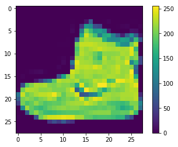
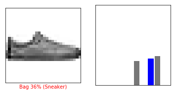
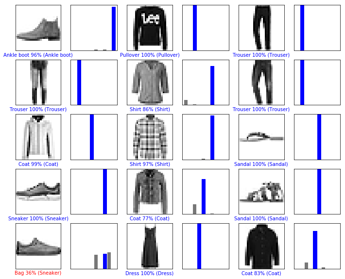

本指南会训练一个对服饰（例如运动鞋和衬衫）图像进行分类的神经网络模型。即使您不了解所有细节也没关系，本教程只是简要介绍了一个完整的 TensorFlow 程序，而且后续我们会详细介绍。

本指南使用的是 tf.keras，它是一种用于在 TensorFlow 中构建和训练模型的高阶 API。


```python
# TensorFlow and tf.keras
import tensorflow as tf
from tensorflow import keras

# Helper libraries
import numpy as np
import matplotlib.pyplot as plt

print(tf.__version__)
```

    1.14.1-dev20190306
    

# 导入Fashion MNIST数据集
本指南使用 Fashion MNIST 数据集，其中包含 70000 张灰度图像，涵盖 10 个类别。以下图像显示了单件服饰在较低分辨率（28x28 像素）下的效果：

Fashion MNIST 的作用是成为经典 MNIST 数据集的简易替换，后者通常用作计算机视觉机器学习程序的“Hello, World”入门数据集。MNIST 数据集包含手写数字（0、1、2 等）的图像，这些图像的格式与我们在本教程中使用的服饰图像的格式相同。

本指南使用 Fashion MNIST 实现多样化，并且它比常规 MNIST 更具挑战性。这两个数据集都相对较小，用于验证某个算法能否如期正常运行。它们都是测试和调试代码的良好起点。

我们将使用 60000 张图像训练网络，并使用 10000 张图像评估经过学习的网络分类图像的准确率。您可以从 TensorFlow 直接访问 Fashion MNIST，只需导入和加载数据即可：


```python
fashion_mnist = keras.datasets.fashion_mnist

(train_images, train_labels), (test_images, test_labels) = fashion_mnist.load_data()
```

    Downloading data from https://storage.googleapis.com/tensorflow/tf-keras-datasets/train-labels-idx1-ubyte.gz
    32768/29515 [=================================] - 0s 3us/step
    Downloading data from https://storage.googleapis.com/tensorflow/tf-keras-datasets/train-images-idx3-ubyte.gz
    26427392/26421880 [==============================] - 27s 1us/step
    Downloading data from https://storage.googleapis.com/tensorflow/tf-keras-datasets/t10k-labels-idx1-ubyte.gz
    8192/5148 [===============================================] - 0s 0us/step
    Downloading data from https://storage.googleapis.com/tensorflow/tf-keras-datasets/t10k-images-idx3-ubyte.gz
    4423680/4422102 [==============================] - 2s 0us/step
    

加载数据集会返回 4 个 NumPy 数组：

train_images 和 train_labels 数组是训练集，即模型用于学习的数据。
测试集 test_images 和 test_labels 数组用于测试模型。
图像为 28x28 的 NumPy 数组，像素值介于 0 到 255 之间。标签是整数数组，介于 0 到 9 之间。这些标签对应于图像代表的服饰所属的类别：

|标签|	类别|
|-----|-----|
|0	|T 恤衫/上衣|
|1	|裤子|
|2	|套衫|
|3	|裙子|
|4	|外套
|5	|凉鞋
|6	|衬衫
|7	|运动鞋
|8	|包包
|9	|踝靴
每张图像都映射到一个标签。由于数据集中不包含类别名称，因此将它们存储在此处，以便稍后在绘制图像表时使用：


```python
class_names = ['T-shirt/top', 'Trouser', 'Pullover', 'Dress', 'Coat',
               'Sandal', 'Shirt', 'Sneaker', 'Bag', 'Ankle boot']
```

# 探索数据


```python
train_images.shape
```


    (60000, 28, 28)


训练集中有 60000 张图像，每张图像都表示为 28x28 像素：


```python
len(train_labels)
```


    60000


```python
train_labels
```


    array([9, 0, 0, ..., 3, 0, 5], dtype=uint8)


```python
len(test_labels)
```


    10000


# 预处理数据
必须先对数据进行预处理，然后再训练网络。如果您检查训练集中的第一张图像，就会发现像素值介于 0 到 255 之间：


```python
plt.figure()
plt.imshow(train_images[0])
plt.colorbar()
plt.grid(False)
```





我们将这些值缩小到 0 到 1 之间，然后将其馈送到神经网络模型。为此，将图像组件的数据类型从整数转换为浮点数，然后除以 255。以下是预处理图像的函数：

务必要以相同的方式对训练集和测试集进行预处理：


```python
train_images = train_images / 255.0

test_images = test_images / 255.0
```

显示训练集中的前 25 张图像，并在每张图像下显示类别名称。验证确保数据格式正确无误，然后我们就可以开始构建和训练网络了。


```python
plt.figure(figsize=(10,10))
for i in range(25):
    plt.subplot(5,5,i+1)
    plt.xticks([])
    plt.yticks([])
    plt.grid(False)
    plt.imshow(train_images[i], cmap=plt.cm.binary)
    plt.xlabel(class_names[train_labels[i]])
```


# 构建模型
构建神经网络需要先配置模型的层，然后再编译模型。

## 设置层
神经网络的基本构造块是层。层从馈送到其中的数据中提取表示结果。希望这些表示结果有助于解决手头问题。

大部分深度学习都会把简单的层连在一起。大部分层（例如 tf.keras.layers.Dense）都具有在训练期间要学习的参数。


```python
model = keras.Sequential([
    keras.layers.Flatten(input_shape=(28, 28)),
    keras.layers.Dense(128, activation=tf.nn.relu),    #（28*28）*128全连接层
    keras.layers.Dense(10, activation=tf.nn.softmax)    # 128*10全连接层
])
```

    WARNING: Logging before flag parsing goes to stderr.
    W0315 15:35:54.372718 10412 deprecation.py:506] From d:\python\lib\site-packages\tensorflow\python\ops\init_ops.py:1257: calling VarianceScaling.__init__ (from tensorflow.python.ops.init_ops) with dtype is deprecated and will be removed in a future version.
    Instructions for updating:
    Call initializer instance with the dtype argument instead of passing it to the constructor
    

该网络中的第一层 tf.keras.layers.Flatten 将图像格式从二维数组（28x28 像素）转换成一维数组（28 * 28 = 784 像素）。可以将该层视为图像中像素未堆叠的行，并排列这些行。该层没有要学习的参数；它只改动数据的格式。

在扁平化像素之后，该网络包含两个 tf.keras.layers.Dense 层的序列。这些层是密集连接或全连接神经层。第一个 Dense 层具有 128 个节点（或神经元）。第二个（也是最后一个）层是具有 10 个节点的 softmax 层，该层会返回一个具有 10 个概率得分的数组，这些得分的总和为 1。每个节点包含一个得分，表示当前图像属于 10 个类别中某一个的概率。

## 编译模型
模型还需要再进行几项设置才可以开始训练。这些设置会添加到模型的编译步骤：

- 损失函数 - 衡量模型在训练期间的准确率。我们希望尽可能缩小该函数，以“引导”模型朝着正确的方向优化。
- 优化器 - 根据模型看到的数据及其损失函数更新模型的方式。
- 指标 - 用于监控训练和测试步骤。以下示例使用准确率，即图像被正确分类的比例。


```python
model.compile(optimizer=tf.train.AdamOptimizer(),
              loss='sparse_categorical_crossentropy',
              metrics=['accuracy'])
```

## 训练模型
训练神经网络模型需要执行以下步骤：

- 将训练数据馈送到模型中，在本示例中为 train_images 和 train_labels 数组。
- 模型学习将图像与标签相关联。
- 我们要求模型对测试集进行预测，在本示例中为 test_images 数组。我们会验证预测结果是否与 test_labels 数组中的标签一致。
要开始训练，请调用 model.fit 方法，使模型与训练数据“拟合”：


```python
model.fit(train_images, train_labels, epochs=5)
```

    W0315 16:33:02.771356 10412 deprecation.py:506] From d:\python\lib\site-packages\tensorflow\python\training\slot_creator.py:187: calling Zeros.__init__ (from tensorflow.python.ops.init_ops) with dtype is deprecated and will be removed in a future version.
    Instructions for updating:
    Call initializer instance with the dtype argument instead of passing it to the constructor
    

    Epoch 1/5
    60000/60000 [==============================] - 3s 49us/sample - loss: 0.4946 - acc: 0.8252
    Epoch 2/5
    60000/60000 [==============================] - 2s 40us/sample - loss: 0.3727 - acc: 0.8652
    Epoch 3/5
    60000/60000 [==============================] - 2s 41us/sample - loss: 0.3354 - acc: 0.8781
    Epoch 4/5
    60000/60000 [==============================] - 2s 39us/sample - loss: 0.3109 - acc: 0.8863
    Epoch 5/5
    60000/60000 [==============================] - 2s 40us/sample - loss: 0.2928 - acc: 0.8917
    


    <tensorflow.python.keras.callbacks.History at 0x16ac22c2eb8>


## 评估准确率
接下来，比较一下模型在测试数据集上的表现：


```python
test_loss, test_acc = model.evaluate(test_images, test_labels)
print('Test accuracy:', test_acc)
```

    10000/10000 [==============================] - 0s 27us/sample - loss: 0.3614 - acc: 0.8708
    Test accuracy: 0.8708
    

结果表明，模型在测试数据集上的准确率略低于在训练数据集上的准确率。训练准确率和测试准确率之间的这种差异表示出现过拟合。如果机器学习模型在新数据上的表现不如在训练数据上的表现，就表示出现过拟合。

做出预测
模型经过训练后，我们可以使用它对一些图像进行预测。


```python
predictions = model.predict(test_images)
```

在本示例中，模型已经预测了测试集中每张图像的标签。我们来看看第一个预测：


```python
predictions[0]
```


    array([9.4128518e-06, 3.3255463e-07, 1.6708922e-05, 1.5156175e-08,
           6.4603264e-06, 1.5716173e-02, 7.9822974e-05, 2.4298407e-02,
           3.0537409e-04, 9.5956725e-01], dtype=float32)


预测结果是一个具有 10 个数字的数组。这些数字说明模型对于图像对应于 10 种不同服饰中每一个服饰的“置信度”。我们可以看到哪个标签的置信度值最大：


```python
np.argmax(predictions[0])
```


    9


```python
test_labels[0]
```


    9


我们可以将该预测绘制成图来查看全部 10 个通道


```python
def plot_image(i, predictions_array, true_label, img):
    predictions_array, true_label, img = predictions_array[i], true_label[i], img[i]
    plt.grid(False)
    plt.xticks([])
    plt.yticks([])

    plt.imshow(img, cmap=plt.cm.binary)

    predicted_label = np.argmax(predictions_array)
    if predicted_label == true_label:
        color = 'blue'
    else:
        color = 'red'

    plt.xlabel("{} {:2.0f}% ({})".format(class_names[predicted_label],
                                    100*np.max(predictions_array),
                                    class_names[true_label]),
                                    color=color)

def plot_value_array(i, predictions_array, true_label):
    predictions_array, true_label = predictions_array[i], true_label[i]
    plt.grid(False)
    plt.xticks([])
    plt.yticks([])
    thisplot = plt.bar(range(10), predictions_array, color="#777777")
    plt.ylim([0, 1])
    predicted_label = np.argmax(predictions_array)

    #[predicted_label].set_color('red')
    thisplot[true_label].set_color('blue')
```

我们来看看第 0 张图像、预测和预测数组。


```python
i = 0
plt.figure(figsize=(6,3))
plt.subplot(1,2,1)
plot_image(i, predictions, test_labels, test_images)
plt.subplot(1,2,2)
plot_value_array(i, predictions,  test_labels)
```


```python
i = 12
plt.figure(figsize=(6,3))
plt.subplot(1,2,1)
plot_image(i, predictions, test_labels, test_images)
plt.subplot(1,2,2)
plot_value_array(i, predictions,  test_labels)
```





```python
# Plot the first X test images, their predicted label, and the true label
# Color correct predictions in blue, incorrect predictions in red
num_rows = 5
num_cols = 3
num_images = num_rows*num_cols
plt.figure(figsize=(2*2*num_cols, 2*num_rows))
for i in range(num_images):
  plt.subplot(num_rows, 2*num_cols, 2*i+1)
  plot_image(i, predictions, test_labels, test_images)
  plt.subplot(num_rows, 2*num_cols, 2*i+2)
  plot_value_array(i, predictions, test_labels)
```




